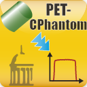

SlicerPETPhantomAnalysis Extension
=====================================
3D Slicer Extension for Analysis of Uniform Cylinder Phantoms in PET scans.

Documentation: https://www.slicer.org/wiki/Documentation/Nightly/Modules/PETCPhantomAnalysis

Sample data set: https://github.com/QIICR/SlicerPETPhantomAnalysis/releases/download/test-data/PETCylinderPhantom.zip

Acknowledgements
--------

This work is funded in part by [Quantitative Imaging to Assess Response in Cancer Therapy Trials][] NIH grant U01-CA140206 (PIs John Buatti, Tom Casavant, Michael Graham, Milan Sonka) and [Quantitative Image Informatics for Cancer Research][] (QIICR) NIH grant U24 CA180918.

[Quantitative Imaging to Assess Response in Cancer Therapy Trials]: http://imaging.cancer.gov/programsandresources/specializedinitiatives/qin/iowa 
[Quantitative Image Informatics for Cancer Research]: http://qiicr.org 
